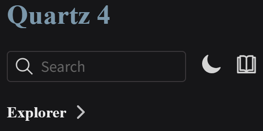
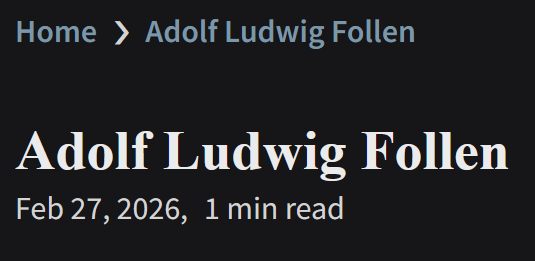
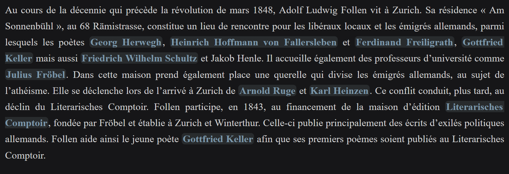
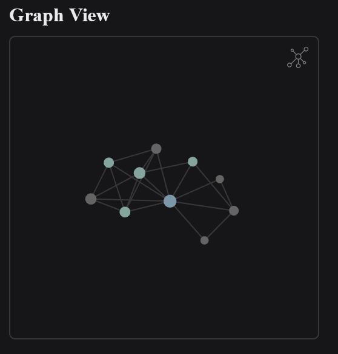
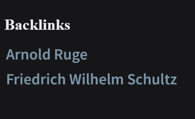
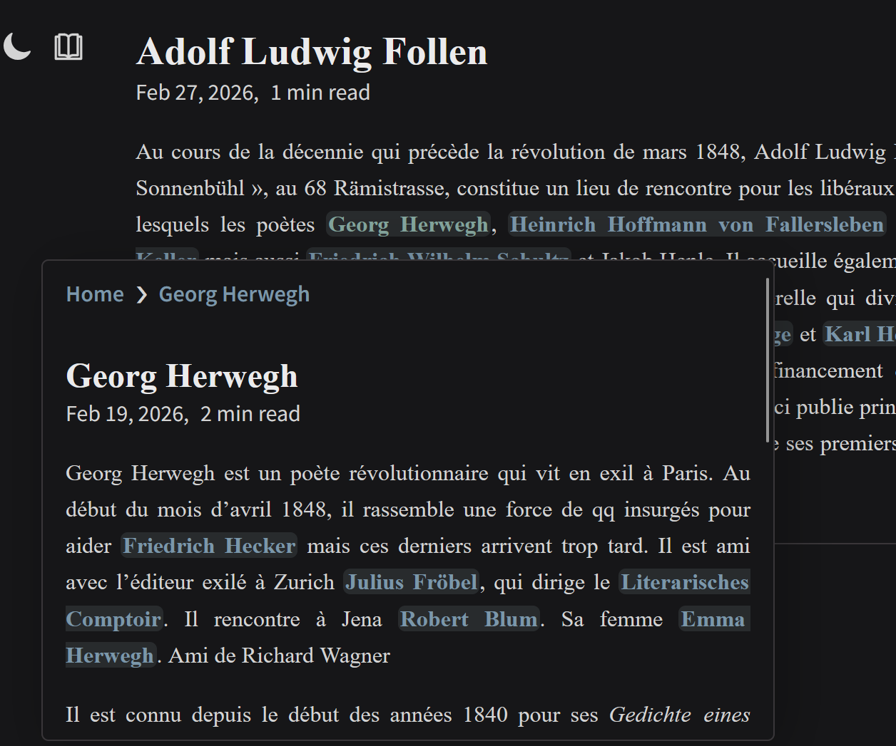

# Utilisation de ce site

Bienvenue sur le site dédié au réseau des émigrés allemands, du *Vormärz* aux révolutions de 1848. Vous trouverez ci-dessous les informations nécessaires pour naviguer dans ce réseau.

## Basculer en mode sombre 

Il est possible de basculer en mode sombre, en appuyant sur le soleil au niveau de la barre de recherche du site. La même action permettra de revenir au mode clair. Cette fonctionnalité peut être utilisée en fonction de vos préférences. 

## Comment accéder aux pages des personnages ?

En arrivant sur le site, il suffit de cliquer sur **"Explorer"** pour obtenir la liste des personnages présentés dans ce réseau. Une page correspond à chacun d'entre eux.

## Quelles sont les informations disponibles ?

Chaque page de personnage contient les informations suivantes :
- La date de sa dernière actualisation. 

- Une présentation du personnage et de ses liens avec les autres. 

- Une vue graphique du réseau dont il est le centre.

- La liste des fiches mentionnant ce personnage. 

## Comment naviguer entre les personnages ?

Pour passer d'un personnage à l'autre, il suffit d'appuyer sur un rétrolien : 
- Dans la page ouverte. 
- Dans les "Backlinks". 
- Sur les noms des personnages à gauche de l'écran.
- Sur un point dans la vue graphique. 
Il est aussi possible d'avoir un aperçu de la fiche d'un autre personnage en plaçant la souris sur le lien. 

## Où trouver la vue graphique ? 

Une vue graphique a été réalisée pour visualiser le réseau. Il est possible d'y accéder à partir de la page d'accueil, ou de celle de chaque personnage, en appuyant sur cette icône en haut à droite de l'écran :

Vous pouvez agrandir des parties du réseau et voir les noms des individus en zoomant. 